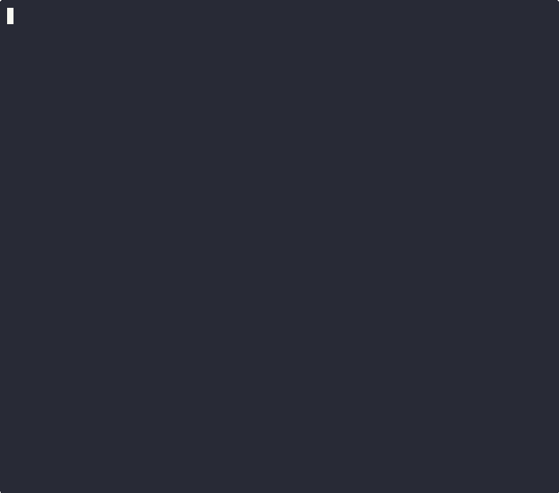

# ASCII-ART

<div align="center">

[](https://golang.org/)
[](https://opensource.org/licenses/MIT)



**Generate beautiful ASCII art from text with multiple banner styles**

</div>

## 📋 Table of Contents

1. [🎯 About](#-about)
2. [📁 File Structure](#-file-structure)
3. [✨ Features](#-features)
4. [🚀 Usage Instructions](#-usage-instructions)
   - [📦 Clone the Repository](#-clone-the-repository)
   - [⚙️ Run the CLI](#️-run-the-cli)
5. [🔭 Future Plans](#-future-plans)
6. [🤝 Contributions](#-contributions)
7. [🙏 Acknowledgements](#-acknowledgements)
8. [📄 License](#-license)

---

## 🎯 About

**ASCII Art Generator** transforms text into stylized ASCII art using multiple banner templates. Built in Go as part of the **01 Founders** curriculum, this project demonstrates:

- Clean modular architecture
- File parsing and rendering techniques
- Comprehensive unit and E2E testing
- Command-line interface design

The tool handles multi-line input, offers three distinct banner styles, and is structured for easy extension — making it both practical and fun to use.

---

## 📁 File structure

```
.
├── README.md
├── ROADMAP.md
├── banners                 // Banner files for rendering ASCII art
│   ├── shadow.txt
│   ├── standard.txt
│   └── thinkertoy.txt
├── cmd                     // Main entry point
│   └── main.go
├── go.mod
└── internal
    ├── ascii               // Core ASCII logic
    │   ├── input.go
    │   ├── input_test.go
    │   ├── loadBanner.go
    │   ├── loadBanner_test.go
    │   ├── renderAscii.go
    │   └── renderAscii_test.go
    ├── e2e                 // End-to-end integration tests
    │   └── e2e_test.go
    └── files               // File reading utilities
        ├── readFile.go
        └── readFile_test.go

7 directories, 17 files
```

---

## ✨ Features

- 🖊️ Takes user input from the command line and renders it as ASCII art
- 🎨 Supports multiple banner styles (`standard`, `shadow`, `thinkertoy`)
- 📜 Handles multi-line input using `\n` escape characters
- 💡 Clean and modular Go codebase for easy readability and testing

---

## 🚀 Usage Instructions

### 📦 Clone the repository

First, clone the repository to your local machine:

```bash
git clone https://learn.01founders.co/git/iyoussef/Ascii-Art.git
cd Ascii-Art
```

### ⚙️ Run the CLI

```bash
go run ./cmd "Hello World" <banner-choice>
```

You can use either `standard`, `shadow` or `thinkertoy` as your banner choice for styling. If omitted, the standard banner will be used by default.

To print text on multiple lines, use `\n` in your string input:

```bash
go run ./cmd "Hello\nWorld" <banner-choice>
```

---

## 🔭 Future Plans

Here are a few enhancements I plan to add in future updates:

- 🎨 **Color Output**: Add a `--color` flag so users can stylize their ASCII art with terminal color codes (e.g., red, green, cyan, etc.)
- 🔄 **Reverse Mode**: Option to reverse the input text before rendering it in ASCII format
- 💾 **Output to File**: Allow users to save the ASCII art output to a file of their choice using an `--output` or `-o` flag
- 📏 **Text Alignment**: Add flags for aligning text output (`--left`, `--center`, `--right`) for better formatting control
- 🛠 **CLI flag support** in builder (e.g., --os linux, --zip, --clean)

---

## 🤝 Contributions

Contributions are welcome! If you'd like to help improve **ASCII Art**, please follow these steps:

1. **Fork the Repository:**  
   Click the "Fork" button at the top-right of the repository page to create your own copy of the project.

2. **Create a New Branch:**  
   Create a new branch for your feature or bug fix:

```bash
   git checkout -b feature-or-bugfix-description
```

3. **Make your Changes:**  
   Implement your changes and ensure that your code adheres to the project's style guidelines.  
   Tip: Write or update tests as needed.

4. **Commit and Push your Changes:**  
   Commit your changes with a clear, descriptive message and push your branch to your forked repository:

```bash
   git commit -m "Add: description of your changes"
   git push origin feature-or-bugfix-description
```

5. **Open a Pull Request:**  
   Open a pull request (PR) from your branch to the main repository. Please include a clear description of your changes and the motivation behind them.  
   If you're not sure about a major change, open an issue first to discuss your ideas.

Thank you for helping make ASCII Art even better!

---

## 🙏 Acknowledgements

- Created as part of my Go learning journey at 01 Founders
- Inspired by classic ASCII art and terminal aesthetics
- Thank you to the Go Community for excellent documentation 🙏

---

## 📄 License

This project is licensed under the **MIT License**.

```
MIT License

Copyright (c) 2025 IbsYoussef

Permission is hereby granted, free of charge, to any person obtaining a copy
of this software and associated documentation files (the "Software"), to deal
in the Software without restriction, including without limitation the rights
to use, copy, modify, merge, publish, distribute, sublicense, and/or sell
copies of the Software, and to permit persons to whom the Software is
furnished to do so, subject to the following conditions:

The above copyright notice and this permission notice shall be included in all
copies or substantial portions of the Software.

THE SOFTWARE IS PROVIDED "AS IS", WITHOUT WARRANTY OF ANY KIND, EXPRESS OR
IMPLIED, INCLUDING BUT NOT LIMITED TO THE WARRANTIES OF MERCHANTABILITY,
FITNESS FOR A PARTICULAR PURPOSE AND NONINFRINGEMENT. IN NO EVENT SHALL THE
AUTHORS OR COPYRIGHT HOLDERS BE LIABLE FOR ANY CLAIM, DAMAGES OR OTHER
LIABILITY, WHETHER IN AN ACTION OF CONTRACT, TORT OR OTHERWISE, ARISING FROM,
OUT OF OR IN CONNECTION WITH THE SOFTWARE OR THE USE OR OTHER DEALINGS IN THE
SOFTWARE.
```

See [LICENSE.txt](LICENSE.txt) for full details.

---

<div align="center">

**[⬆ Back to Top](#ascii-art)**

</div>
